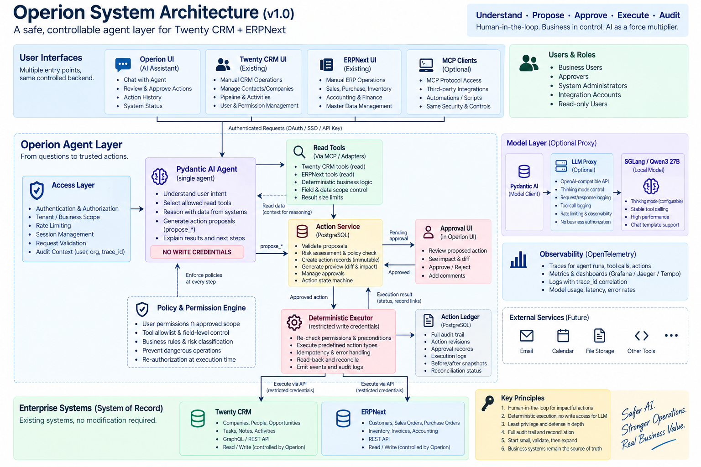

# Operion

English | [中文](README.zh-CN.md)

Operion is a controlled business agent layer built on top of Twenty CRM and
ERPNext. Agent and MCP workflows are the product focus; the business systems and a
lightweight ETL pipeline provide governed facts and tools.

The goal is to keep material business judgment with people while agents help with
search, consolidation, recommendations, and narrowly controlled execution.



## Current status

The project currently includes:

- a reproducible Wide World Importers download and minimal ETL pipeline;
- canonical records and target mappings for Twenty and ERPNext;
- pre-import validation for the generated files;
- a small Twenty Company import with REST readback into the identity map;
- an ERPNext readback audit command for reconciling manually imported batches; and
- an enterprise operating plan with staged security and acceptance gates.

The Twenty People import, ERPNext business-state setup, read-only business tools,
MCP layer, and agent are still in progress. Generated exports are evidence of
mapping, not evidence that the corresponding target records were imported.

The minimum demonstration is a customer overview plus a deterministic order
fulfilment check, backed by 15 fixed evaluation cases. The first agent-initiated
write is deliberately limited to creating one internal follow-up task after an
exact preview and human approval.

Delivery sequence:

```text
use cases and expected answers
  → small linked dataset
  → read-only adapters
  → business tools and MCP
  → agent and evaluations
  → one controlled write
  → synchronization when justified
```

## Documentation

The detailed design documents are currently written in Chinese:

- [Enterprise operating plan and staged subplans](docs/enterprise/README.md)
- [Agent and MCP boundaries](docs/agent-boundaries.md)
- [Minimum demonstration and evaluations](docs/minimum-demo.md)
- [Human functions and agent design map](docs/human-functions-agent-map.md)
- [Data directory conventions](data/README.md)
- [WWI download and ETL runbook](ops/data-pipeline.md)
- [Canonical data contract](contracts/canonical-v1.md)

## Repository layout

```text
operion/
├── src/operion_etl/          # Reproducible extraction, mapping, validation, and audits
├── tests/                    # Deterministic ETL and validation tests
├── contracts/                # Canonical data and future tool contracts
├── mappings/                 # Source-to-target mappings and fixed assumptions
├── docs/                     # Product, safety, evaluation, and operating plans
├── ops/                      # Runbooks for data preparation and recovery
├── evaluations/              # Evaluation definitions and fixtures
├── data/                     # Local source snapshots and generated exports
└── reports/                  # Local validation and reconciliation evidence
```

Business data and generated reports are excluded from version control by default.

## ETL quick start

Requirements: Python 3.11+, Docker, and the source/target systems described in the
[runbook](ops/data-pipeline.md).

```bash
PYTHONPATH=src python3 -m operion_etl download-wwi
scripts/restore_wwi.sh data/raw/wwi/<snapshot>/WideWorldImporters-Full.bak
PYTHONPATH=src python3 -m operion_etl run \
  --snapshot data/raw/wwi/<snapshot> \
  --batch-id <unique-batch-id>
```

Run the deterministic test suite with:

```bash
PYTHONPATH=src python3 -m unittest discover -s tests -v
```

See the [runbook](ops/data-pipeline.md) for pre-import validation, Twenty loading,
ERPNext import prerequisites, and post-import reconciliation.
